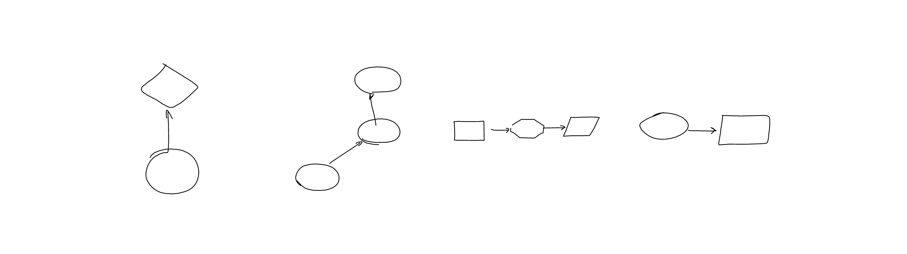

# sketch-rnn on flowchart diagrams

Web browser demo (mobile friendly): https://otoro.net/flowchart-rnn/

Multiple prediction demo (not mobile-friendly): https://otoro.net/flowchart-rnn/multi.html



A small experiment training [`sketch-rnn-js`](https://github.com/tensorflow/magenta-demos/tree/master/sketch-rnn-js) on a flowchart dataset.

- `sketch-rnn` paper: https://arxiv.org/abs/1704.03477

- `sketch-rnn` blog post: https://blog.otoro.net/2017/05/19/teaching-machines-to-draw/

- `sketch-rnn` tensorflow: https://github.com/tensorflow/magenta/tree/master/magenta/models/sketch_rnn

- didi dataset paper: https://arxiv.org/abs/2002.09303

- didi dataset: https://github.com/google-research/google-research/tree/master/didi_dataset


# citations

```
@article{ha2017sketchrnn,
  title={A neural representation of sketch drawings},
  author={Ha, David and Eck, Douglas},
  journal={arXiv preprint arXiv:1704.03477},
  year={2017}
}
```

```
@article{gervais2020didi,
  title={The DIDI dataset: Digital Ink Diagram data},
  author={Gervais, Philippe and Deselaers, Thomas and Aksan, Emre and Hilliges, Otmar},
  journal={arXiv preprint arXiv:2002.09303},
  year={2020}
}
```

# license

same license as sketch-rnn-js and didi dataset
